# Informe de Resultados - TP Integrador Machine Learning

*Generado: 2026-06-24 15:17:11*

Total de algoritmos ejecutados: **12**

---

## Regresión Lineal Simple

- **Dataset:** Diabetes (scikit-learn) - solo variable BMI
- **Descripción:** Predice la progresión de la diabetes a partir del índice de masa corporal.
- **Tipo:** Regresión
- **Muestras / Variables:** 442 / 1

**Métricas:**

| Métrica | Valor |
|---|---|
| MAE | 52.2600 |
| MSE | 4061.8259 |
| RMSE | 63.7325 |
| R2 | 0.2334 |

**Comparación con lo esperado:** Con una sola variable el R2 es bajo (~0.23), lo esperado: el BMI explica solo parte de la progresión. La pendiente positiva confirma que a mayor BMI, mayor progresión.

**Gráficos:**

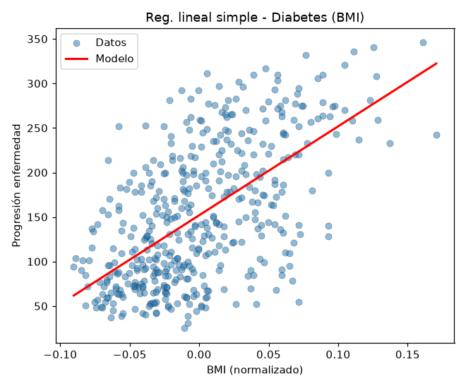

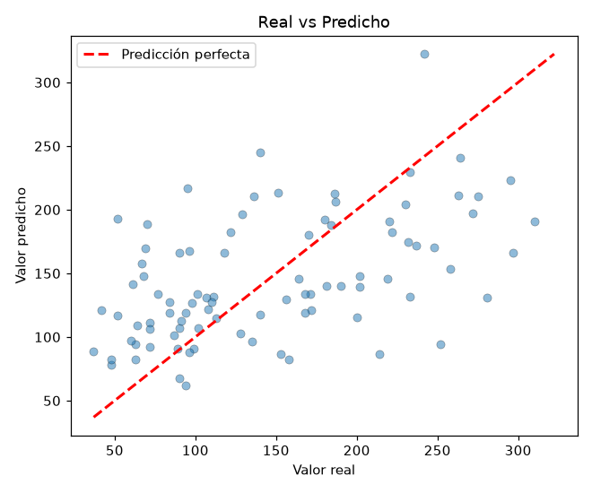

---

## Regresión Lineal Múltiple

- **Dataset:** Sintético multivariable (make_regression)
- **Descripción:** Dataset simulado con 8 variables (6 informativas) y ruido; respaldo offline cuando no se puede descargar California Housing.
- **Tipo:** Regresión
- **Muestras / Variables:** 600 / 8

**Métricas:**

| Métrica | Valor |
|---|---|
| MAE | 11.3214 |
| MSE | 209.5874 |
| RMSE | 14.4771 |
| R2 | 0.9868 |

**Comparación con lo esperado:** Al usar todas las variables el R2 sube (~0.99) respecto del modelo simple, como se espera. La relación es parcialmente lineal, por eso el R2 no es cercano a 1.

**Gráficos:**

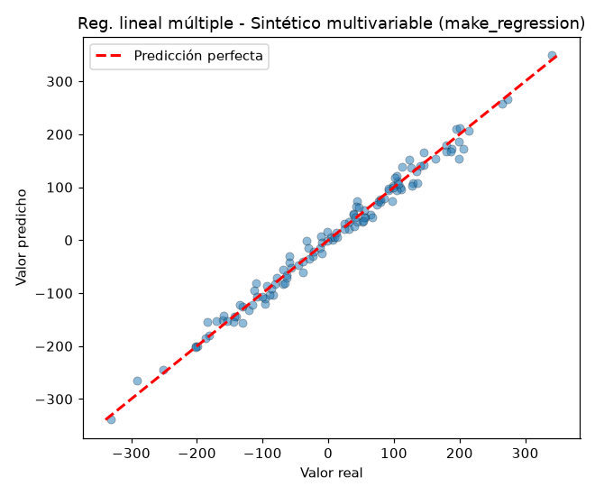

---

## Regresión Polinomial (grado 3)

- **Dataset:** Dataset sintético no lineal (y = 0.5x^3 - x^2 + 2x + ruido)
- **Descripción:** Datos simulados con relación cúbica para ajustar una curva polinómica.
- **Tipo:** Regresión
- **Muestras / Variables:** 300 / 1

**Métricas:**

| Métrica | Valor |
|---|---|
| MAE | 1.8807 |
| MSE | 5.9881 |
| RMSE | 2.4471 |
| R2 | 0.9316 |

**Comparación con lo esperado:** El ajuste polinómico captura la curva y logra un R2 alto (~0.93). Una recta lineal aquí fallaría: lo esperado es que el grado 3 modele bien la forma de los datos.

**Gráficos:**

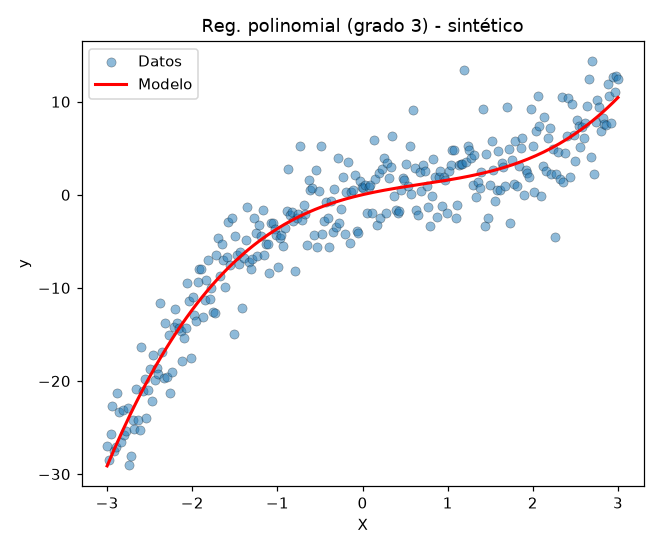

---

## SVR - Support Vector Regression

- **Dataset:** Diabetes (scikit-learn) - 10 variables
- **Descripción:** Regresión con vectores de soporte y kernel RBF sobre la progresión.
- **Tipo:** Regresión
- **Muestras / Variables:** 442 / 10

**Métricas:**

| Métrica | Valor |
|---|---|
| MAE | 39.4187 |
| MSE | 2607.5423 |
| RMSE | 51.0641 |
| R2 | 0.5078 |

**Comparación con lo esperado:** El SVR con kernel RBF obtiene un R2 ~0.51, similar al lineal porque el dataset es casi lineal. Es clave escalar los datos antes de entrenar, como se espera en SVM/SVR.

**Gráficos:**

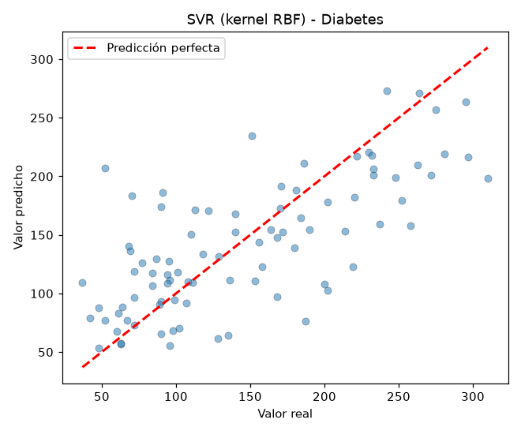

---

## Árbol de Decisión (Regresión)

- **Dataset:** Sintético multivariable (make_regression)
- **Descripción:** Dataset simulado con 8 variables (6 informativas) y ruido; respaldo offline cuando no se puede descargar California Housing.
- **Tipo:** Regresión
- **Muestras / Variables:** 600 / 8

**Métricas:**

| Métrica | Valor |
|---|---|
| MAE | 56.7623 |
| MSE | 4877.1598 |
| RMSE | 69.8367 |
| R2 | 0.6924 |

**Comparación con lo esperado:** El árbol (max_depth=6) capta relaciones no lineales y mejora al lineal (R2 ~0.69). Se limita la profundidad para evitar sobreajuste, como es esperable.

**Gráficos:**

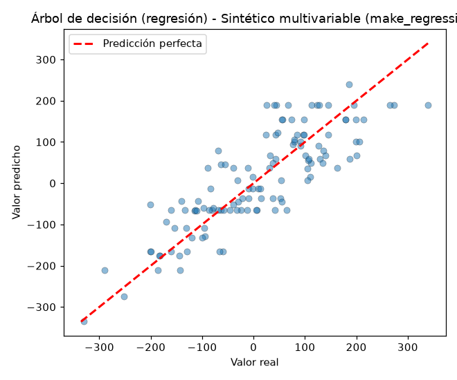

---

## Bosque Aleatorio (Regresión)

- **Dataset:** Diabetes (scikit-learn) - 10 variables
- **Descripción:** Conjunto de 200 árboles para predecir la progresión de la enfermedad.
- **Tipo:** Regresión
- **Muestras / Variables:** 442 / 10

**Métricas:**

| Métrica | Valor |
|---|---|
| MAE | 44.2761 |
| MSE | 2966.0242 |
| RMSE | 54.4612 |
| R2 | 0.4402 |

**Comparación con lo esperado:** El bosque promedia muchos árboles y reduce la varianza (R2 ~0.44). Suele igualar o superar al árbol único, que es lo esperado por el efecto de ensamble.

**Gráficos:**

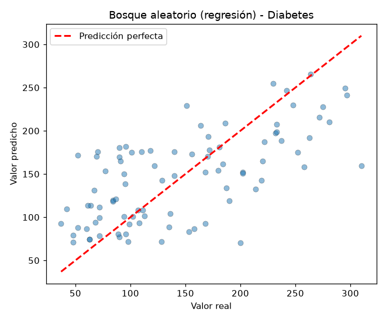

---

## Regresión Logística

- **Dataset:** Breast Cancer (scikit-learn)
- **Descripción:** Clasifica tumores en benignos/malignos según 30 características.
- **Tipo:** Clasificación
- **Muestras / Variables:** 569 / 30

**Métricas:**

| Métrica | Valor |
|---|---|
| Accuracy | 0.9825 |
| Precision | 0.9825 |
| Recall | 0.9825 |
| F1 | 0.9825 |

**Comparación con lo esperado:** Alcanza una exactitud alta (~0.98), lo esperado en este dataset bien separable. El escalado mejora la convergencia.

**Gráficos:**

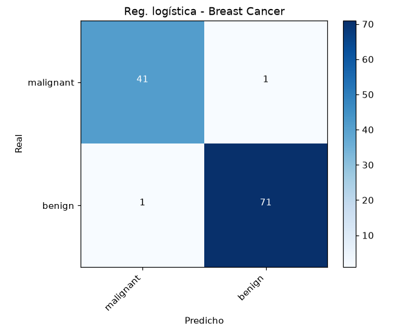

---

## K Vecinos Más Cercanos (KNN)

- **Dataset:** Wine (scikit-learn)
- **Descripción:** Clasifica vinos en 3 cultivares según 13 propiedades químicas.
- **Tipo:** Clasificación
- **Muestras / Variables:** 178 / 13

**Métricas:**

| Métrica | Valor |
|---|---|
| Accuracy | 0.9722 |
| Precision | 0.9747 |
| Recall | 0.9722 |
| F1 | 0.9724 |

**Comparación con lo esperado:** Con k=5 y datos escalados logra exactitud ~0.97. El escalado es imprescindible en KNN porque usa distancias; sin él el rendimiento caería, tal como se espera.

**Gráficos:**

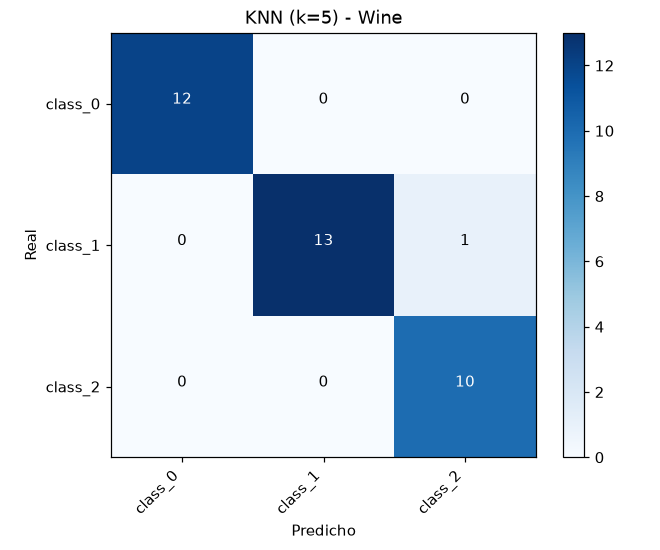

---

## SVM - Máquinas de Vectores de Soporte

- **Dataset:** Digits (scikit-learn)
- **Descripción:** Reconoce dígitos manuscritos (0-9) a partir de imágenes 8x8.
- **Tipo:** Clasificación
- **Muestras / Variables:** 1797 / 64

**Métricas:**

| Métrica | Valor |
|---|---|
| Accuracy | 0.9806 |
| Precision | 0.9810 |
| Recall | 0.9806 |
| F1 | 0.9805 |

**Comparación con lo esperado:** El SVM con kernel RBF obtiene exactitud muy alta (~0.98) en reconocimiento de dígitos, resultado esperado: SVM es muy efectivo en alta dimensión.

**Gráficos:**

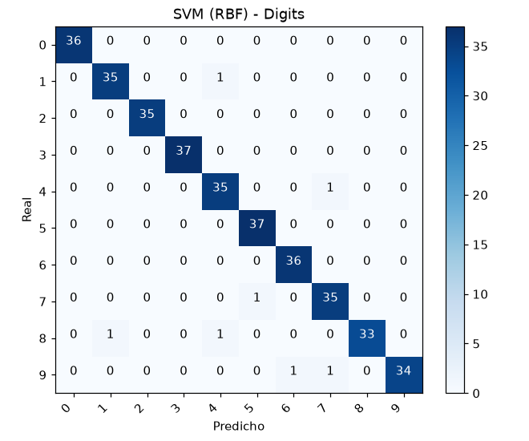

---

## Naive Bayes (Gaussiano)

- **Dataset:** Wine (scikit-learn)
- **Descripción:** Clasifica vinos en 3 cultivares asumiendo variables gaussianas.
- **Tipo:** Clasificación
- **Muestras / Variables:** 178 / 13

**Métricas:**

| Métrica | Valor |
|---|---|
| Accuracy | 0.9722 |
| Precision | 0.9744 |
| Recall | 0.9722 |
| F1 | 0.9723 |

**Comparación con lo esperado:** Pese a asumir independencia entre variables, logra exactitud ~0.97. Es rápido y simple; el buen resultado es lo esperado en datasets donde las clases están bien separadas.

**Gráficos:**

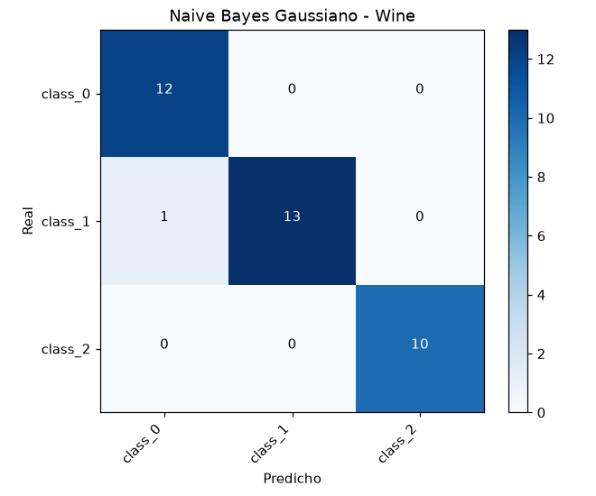

---

## Árbol de Decisión (Clasificación)

- **Dataset:** Breast Cancer (scikit-learn)
- **Descripción:** Clasifica tumores benignos/malignos con reglas interpretables.
- **Tipo:** Clasificación
- **Muestras / Variables:** 569 / 30

**Métricas:**

| Métrica | Valor |
|---|---|
| Accuracy | 0.9211 |
| Precision | 0.9234 |
| Recall | 0.9211 |
| F1 | 0.9216 |

**Comparación con lo esperado:** El árbol (max_depth=5) da exactitud ~0.92 y es interpretable. Limitar la profundidad evita el sobreajuste típico de los árboles, como se espera.

**Gráficos:**

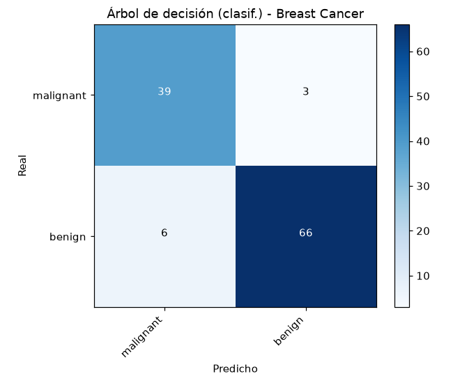

---

## Bosque Aleatorio (Clasificación)

- **Dataset:** Digits (scikit-learn)
- **Descripción:** Reconoce dígitos manuscritos con un conjunto de 200 árboles.
- **Tipo:** Clasificación
- **Muestras / Variables:** 1797 / 64

**Métricas:**

| Métrica | Valor |
|---|---|
| Accuracy | 0.9639 |
| Precision | 0.9644 |
| Recall | 0.9639 |
| F1 | 0.9636 |

**Comparación con lo esperado:** El bosque alcanza exactitud ~0.96, superando al árbol único gracias al ensamble. Resultado esperado y robusto frente al sobreajuste.

**Gráficos:**

---

